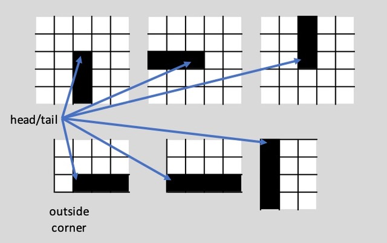

# Weeks 5 & 6 lab
The game **Snake** is a popular game where the player attemps to move a virtual snake around a grid, extending it's length periodically, without running into another section of the virtual snake or the barriers. An example of a game is shown below. 

The players "score" for a game is the length of the snake when it does run into itself or the wall. 

## Project task
Create a new class, `SnakeGame`, which will be used to calculate someones final score.  You will be given the game board and the position of the snakes head, the goal will be to find the position of the snakes tail, and the final length. You will do this by doing both an exhaustive search and recursive search as described below. You will need to also create unit tests using `JUnit` that will test the two methods correctness and the running time (at least 5 for each method independently, or 10 that test both methods at once). Each test should have a comment describing what is being tested. Note the access labeling each element and method below. 

### Elements 
*  `private bool[][] game` -- Stores the final game state, cells that are `true` contain a part of the snake, and `false` are the background. Note that in this version of the game the snake will always have a barrier of one cell (i.e. every neighborhood of 9 cells around a portion of the snake will only ever have at most 3 `true` cells).
* `private int[] headPosition` -- Stores the location of the snake's head. 
* `private static int exhaustiveChecks` -- counts the number of positions checked when performing the tail search using exhaustive enumeration, across all instances of the `SnakeGame`. 
* `private static int recursiveChecks` -- counts the number of positions checked when performing the tail search using recursive search, across all instances of the `SnakeGame`.

### Constructors
* the default constructor, which initializes an empty 1 x 1 gameboard, and 
* a constructor that takes a 2-dimensional boolean array, and the `x` and `y` position of the snakes "head".

### Methods
* `public int[] findTailExhaustive()` -- will find the tail of the snake by searching across the whole grid to find the grid position where a true element is surrounded by only one other true cell (see figure below), but is not the head, and return 3 items: the `x` and `y` position of the tail in the grid, and the `length` of the snake on the board. Incremenets the `exhaustiveChecks` counter with each `(x',y')` that is examined.  

* `public int[] findTailRecursive()` -- will find the tail of the snake by conducting a search starting at the head location and recursively following the snake's body, and return 3 items: the `x` and `y` position of the tail in the grid, and the `length` of the snake on the board. Increments the `recursiveChecks` counter with each `(x',y')` that is examined.
* `private int[] findTailRecursive(int[] currentPosition, int[] previousPosition)` -- overloads the previous method, and is similar in definition, but starts at a position other than the head position (used for the recursive calls), also takes in the position of the previous body position (to exclude it from deciding the next position). Increments the `recursiveChecks` counter with each `(x',y')` that is examined. Hint: the call for starting from the head position made from the public method should be `findTailRecursive(headPosition, headPosition)`.
* `private void resetCounters()` -- resets both the `exhaustiveChecks` and `recursiveChecks` counters to 0. 
* `private static int getRecursiveChecks()` -- gets the current state of the `recursiveChecks` counter. 
* `private static int getExhaustiveChecks()` -- gets the current state of the `exhaustiveChecks` counter. 

## What needs to be turned in
The following files should be turned in by **28 February 2020 at 11:59 PM**.
* `SnakeGame.java`
* `SnakeGameTester.java`

## Grading 
Lateness rule: -10 pts for 1 day of lateness / - 20 pts for 2 days of lateness / 0 after that, but you still have to turn in your work 

| Points | Item |
| --- | --- |
| 60 pts	| `SnakeGame.java` |
| | 5 pts for the constructors |
| | 3 pts for the elements |
| | 7 pts for the getters and reseter |
| | 20 pts for the exhaustive method (and the counting) |
| | 25 pts for the recursive method (and the counting) |
| 40 pts	| `SnakeGameTester.java`| 
| | 4 pts each test case, including comments|
